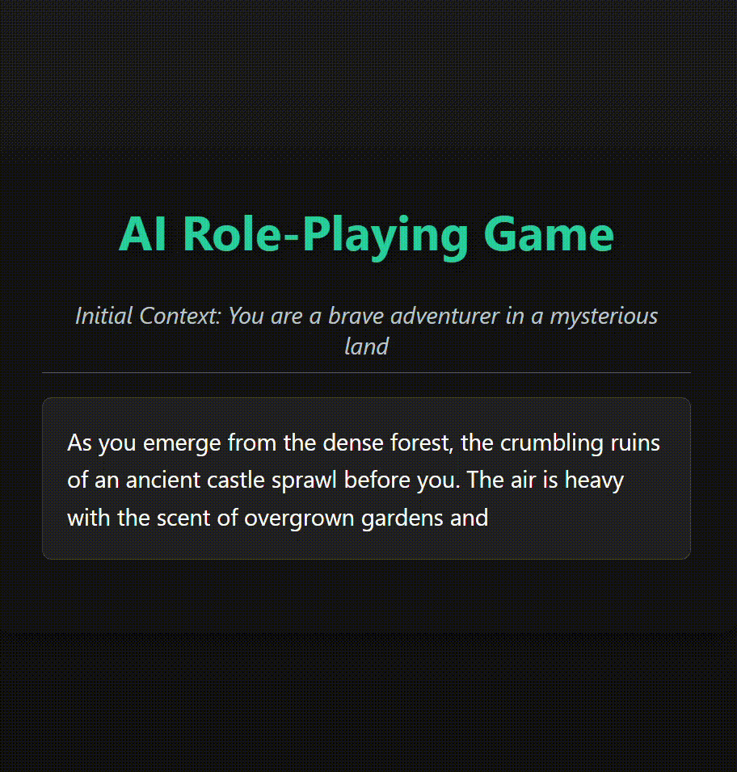

# 🌟 Interactive Story Generator 🌟

Welcome to the **AI RPG**, a storytelling experience where you are the creator of your own adventure ! Enter a world where your words shape the narrative, and every choice you make influences the outcome. Powered by AI, this tool dynamically generates stories and allows you to steer the plot with every decision. Are you ready to craft your own journey ?



---

## 🚀 Features

- **AI-Powered Story Creation**: Craft endless adventures from a single prompt.
- **Your Choices Matter**: Every decision you make alters the direction of the story.
- **Immersive Experience**: Visual elements and real-time storytelling provide an interactive journey.
- **Engage with Dynamic Worlds**: Explore fantasy realms, space odysseys, mysteries, and more.

---

## 📝 How to Use

1. **Clone the Repository**: 
   ```bash
   git clone https://github.com/Infinityy1001/AI-RPG.git
   ```
Voici le `README.md` entièrement en markdown, prêt à être copié et collé :

```markdown
# 🌟 Interactive Story Generator 🌟

Welcome to the **Interactive Story Generator**, a unique storytelling experience where you are the creator of your own adventure! Enter a world where your words shape the narrative, and every choice you make influences the outcome. Powered by AI, this tool dynamically generates stories and allows you to steer the plot with every decision. Are you ready to craft your own journey?


---

## 🚀 Features

- **AI-Powered Story Creation**: Craft endless adventures from a single prompt.
- **Your Choices Matter**: Every decision you make alters the direction of the story.
- **Immersive Experience**: Visual elements and real-time storytelling provide an interactive journey.
- **Engage with Dynamic Worlds**: Explore fantasy realms, space odysseys, mysteries, and more.

---

## 📝 How to Use

1. **Clone the Repository**: 
   ```bash
   git clone https://github.com/Infinityy1001/interactive-story-generator.git
   ```

2. **Navigate to the Project Directory**:
   ```bash
   cd interactive-story-generator
   ```

3. **Install Dependencies**:
   ```bash
   npm install
   ```

4. **Start the Project Locally**:
   ```bash
   npm start
   ```

5. **Open in Browser**: Go to [http://localhost:3000](http://localhost:3000) and start your adventure!

6. **Begin Your Journey**: Enter a creative prompt and hit **Start** to dive into your personalized story.

---

## ✨ Example Prompts

To get the most out of your adventure, try one of these creative prompts to kickstart your narrative:

### Fantasy Adventures 🏰
- "You are a courageous knight sent on a quest to recover the lost Sword of Light, hidden deep within the dragon's lair."
- "A mysterious portal opens in your living room, leading to a magical realm of unknown creatures and powers."

### Sci-Fi Escapades 🚀
- "You awaken aboard a stranded spaceship, with no memory of how you arrived. The AI is malfunctioning and you need to survive."
- "The year is 2150. You are the last surviving human in a post-apocalyptic Earth, and an alien ship just landed outside your home."

### Thrilling Mysteries 🔍
- "An anonymous letter arrives, containing only a map to a hidden treasure buried beneath an abandoned mansion."
- "In the dead of night, a stranger knocks on your door and whispers that you are in grave danger. What will you do?"

### Post-Apocalyptic Survival 🌍
- "In a world devastated by war, you discover an ancient map leading to a secret underground city where hope might still exist."
- "You wake up in a world overrun by mutants. The last remnants of humanity are on the brink of extinction. Can you survive?"

---

## 📂 File Structure

Here’s an overview of the project structure to help you navigate through the codebase:

```
interactive-story-generator/
├── src/
│   ├── index.html        # Main HTML file for loading the app
│   ├── style.css         # Stylish visuals for an immersive experience
│   ├── script.js         # Core logic for dynamic story generation
├── assets/               # Visual and media assets like images and GIFs
│   └── demo.gif          # A preview GIF of the project in action
├── package.json          # Project configuration and dependencies
├── README.md             # You are currently reading this file
└── dist/                 # Build folder with production-ready assets
```

---

## 💻 Technologies Used

This project combines modern web technologies to create a seamless and immersive storytelling experience:

- **HTML5/CSS3/JavaScript**: Front-end technologies that bring your stories to life.
- **Node.js & npm**: For managing dependencies and project setup.
- **Parcel**: A fast and zero-config bundler for optimized development.

---

## 🤝 Contribution Guidelines

We love contributions! If you want to make the project even better, here’s how you can help:

1. **Fork the Repository**.
2. **Create a New Branch** for your changes:
   ```bash
   git checkout -b feature-name
   ```
3. **Commit Your Changes** and push them to your fork:
   ```bash
   git commit -m "Add amazing new feature"
   git push origin feature-name
   ```
4. **Submit a Pull Request** to contribute your changes back to the main project.

---

## 📝 License

This project is licensed under the **MIT License**. See the [LICENSE](LICENSE) file for more information.

---

## 👤 Author

**Antoine Martinet**  
[GitHub: Infinityy1001](https://github.com/Infinityy1001)  

---

🌟 **Let your imagination run wild and start your adventure today!** 🌟
```

Ce fichier `README.md` est entièrement en markdown. Il inclut des instructions détaillées pour l'installation, des exemples de prompts à utiliser avec votre générateur d'histoires, et bien plus encore. Vous pouvez simplement copier et coller ce code dans votre fichier `README.md`.